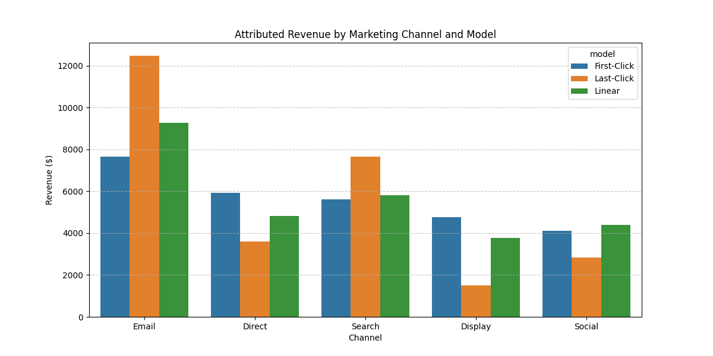
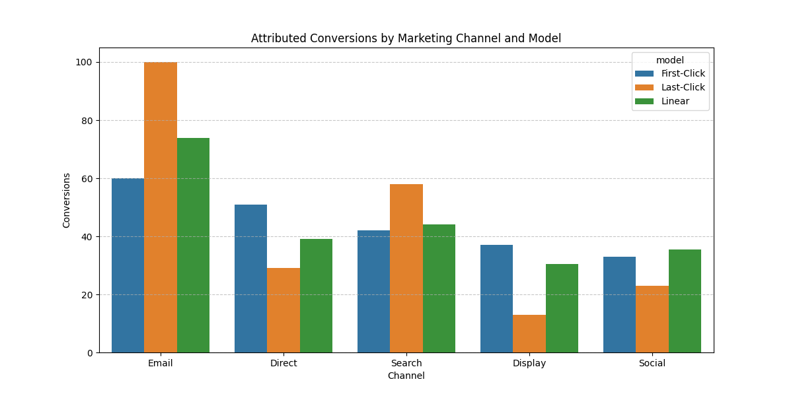
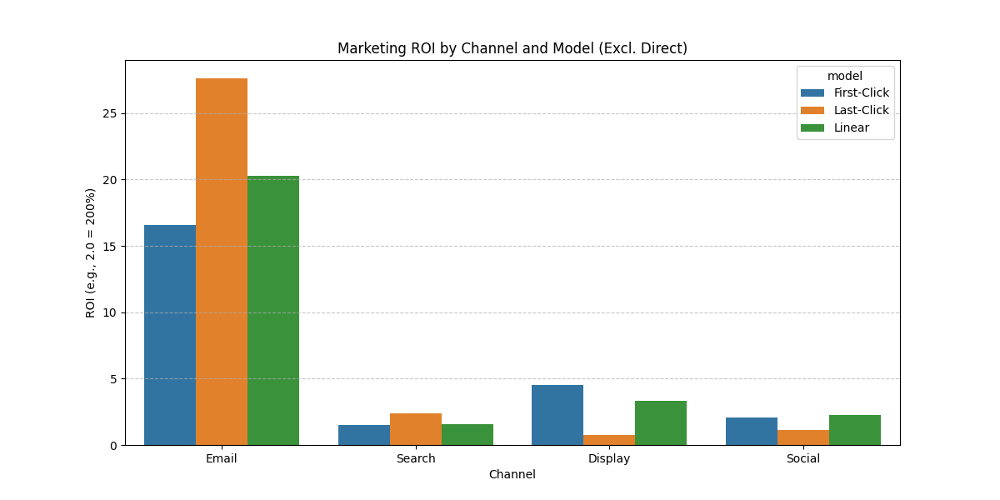

# Marketing Attribution & ROI Analysis Pipeline

This project provides a comprehensive, end-to-end framework for analyzing marketing campaign performance. It integrates SQL-based attribution modeling with Python-driven ROI analysis and data visualization.

## Project Overview

In multi-channel marketing, understanding the true value of each touchpoint is critical. This project implements and compares three fundamental attribution models:

- **First-Click Attribution**: Assigns 100% of conversion credit to the initial customer touchpoint.
- **Last-Click Attribution**: Credits the final interaction immediately preceding the conversion.
- **Linear Attribution**: Distributes credit equally across all touchpoints in the customer journey.

The pipeline further extends these results by incorporating channel-specific cost structures to calculate Return on Investment (ROI) for each model.

## Key Features

- **Automated Data Generation**: Simulates realistic multi-touch customer journeys across Search, Social, Email, Display, and Direct channels.
- **SQL Analytics Engine**: Leverages SQLite and window functions to perform high-performance attribution modeling.
- **ROI Modeling**: Dynamically calculates profitability metrics by merging attributed revenue with marketing spend.
- **Data Visualization**: Generates clear, professional-grade insights into channel performance and revenue distribution.

## Results & Insights

### 1. Attributed Revenue
Comparing revenue distribution across different models helps identify which channels are better at "opening" (First-Click) versus "closing" (Last-Click) conversions.



### 2. Conversion Distribution
Analyzes the volume of conversions attributed to each channel, providing a holistic view of campaign reach.



### 3. Return on Investment (ROI)
By integrating cost data, we can evaluate the actual efficiency of our marketing spend.



## Repository Structure

- `main.py`: The central orchestration script that executes the entire pipeline.
- `generate_data.py`: Script to generate the synthetic marketing dataset.
- `setup_db.py`: Automates database creation and data ingestion into SQLite.
- `attribution_queries.py`: Contains the SQL logic for attribution modeling.
- `calculate_roi.py`: Handles cost-integration and ROI calculations.
- `visualize_results.py`: Produces professional charts and graphs using Seaborn.

## How to Run

1. **Install Dependencies**:
   ```bash
   pip install pandas matplotlib seaborn
   ```
2. **Execute Pipeline**:
   ```bash
   python main.py
   ```

## Requirements
- Python 3.x
- Pandas
- Matplotlib
- Seaborn
- SQLite3 (Included in standard library)
